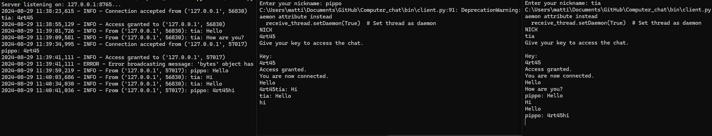

# Computer_chat

## Description

This is a simple program that simulates a chat between a user and another user in another computer. The program is written in Python and uses the socket library to create a connection between the two computers.
The program is divided into two parts: the server and the client. The server is responsible for receiving messages from the client and sending them to the other user, while the client is responsible for sending messages to the server and receiving messages from the other user.
The program is designed to run on two different computers connected to the same network, but it can also run on the same computer using different ports.

### Note: This program is for educational purposes only and should not be used for any malicious purposes.

There are some minor bugs in the program that need to be fixed, and the program is not secure, so it should not be used for any sensitive information.

## Requirements

python >= 3.9

To run the project, you need to have Python installed on your machine. You can download Python from the [official website](https://www.python.org/downloads/)

**Setting Up the Environment**

* Windows: `./setup_Windows.bat`
* Linux/macOS: `./setup_Linux.sh`

These scripts will install required dependencies, and build a virtual environment for you if you don't have one.

## Usage

To run the program, you need to run the server first and then the client. The server will wait for a connection from the client, and once the connection is established, the chat will start.

To run the server, you need to run the following command:

```bash
python server.py
```

To run the client, you need to run the following command:

```bash
python client.py
```

Here is an example of the chat between the server and the client:

On the left side is the server, and on the right side there are two clients. The server receives messages from the client and sends them to the other client.

### Note:

**you need to change the IP address in the client.py file to the IP address of the computer running the server, if the server is running on the same computer, you can use the localhost IP address (127.0.0.1)**
For the server, look in to the config.ini file and change the IP address to the IP address of the computer running the server.

## License

This project is licensed under the MIT License - see the [LICENSE.md](LICENSE.md) file for details.

## Author